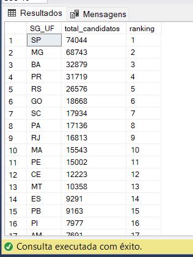
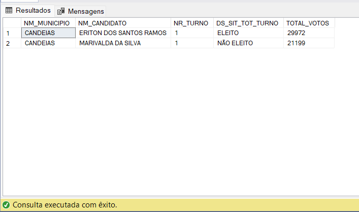
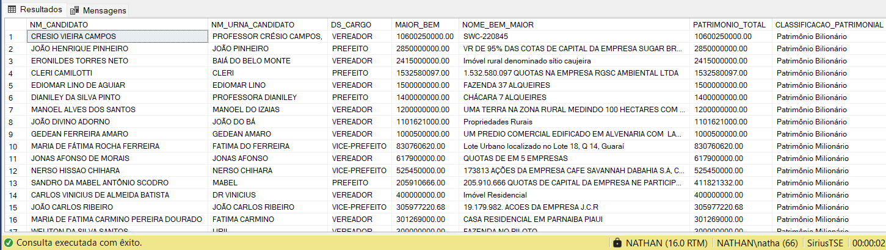
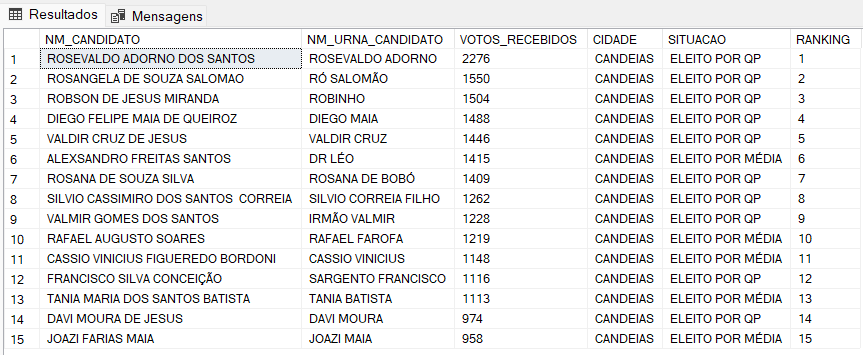
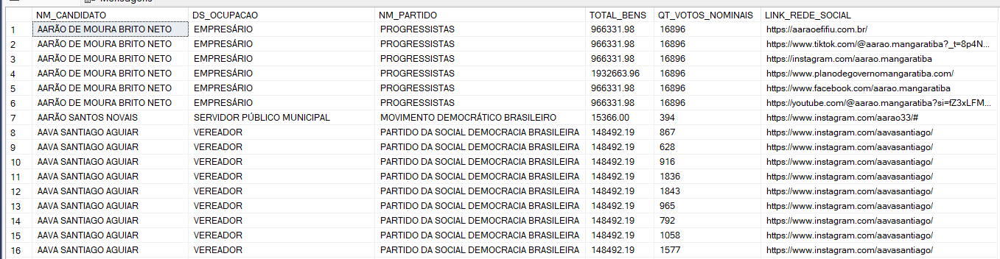
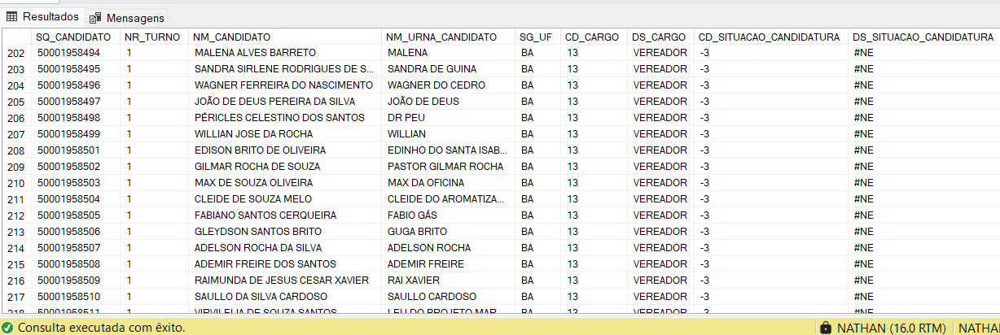

# Projeto MDD

## Descrição:

A Sirius Corporate ganhou uma licitação para atuar em um projeto do Tribunal Superior Eleitoral, e você foi contratado para compor a equipe de Engenharia de Dados.

Algumas das atividades sob sua responsabilidade incluem trabalhar com os dados disponíveis no site do TSE (https://dadosabertos.tse.jus.br/). 

Como 2024 é um ano de eleições municipais, você deverá iniciar suas atividades manipulando os dados de candidatos e votação do primeiro turno.

Links que deverão ser trabalhados.

https://dadosabertos.tse.jus.br/dataset/candidatos-2024
https://dadosabertos.tse.jus.br/dataset/resultados-2024/resource/c5e1bff9-98f1-4d3b-b944-37cd22c84112 

## Atividade 01 - A partir do arquivo de CANDIDATOS, gerar o script para criação e carga das tabelas: 

- Candidato;
- UF;
- Cargo;
- Situação Candidatura;
- Partido;
- Grau de Instrução;
- Ocupação;
- Eleição.

- A tabela CANDIDATO, deverá possuir apenas os atributos que você julgar ser de um CANDIDATO e as chaves de relacionamento com as demais tabelas. Não estamos falando de fatos e dimensões, são tabelas normais.

## Entregáveis:

- Script para criação das tabelas; (Na pasta Atividades)
- Script para inserção dos registros. (Na pasta Atividades)

## Atividade 02 – A partir do arquivo BEM_CANDIDATO, gerar o script para criação das tabelas

- Bens de Candidato;
- UF (Aproveitar a mesma tabela criada na Atividade 01);
- Tipo de Bem;
- Eleição (Aproveitar a mesma tabela criada na Atividade 01).

- A tabela BEM_CANDIDATO, deverá possuir apenas os atributos que você julgar ser de um BEM_CANDIDATO e as chaves de relacionamento com as demais tabelas. Não estamos falando de fatos e dimensões, são tabelas normais.

## Entregáveis:

- Script para criação das tabelas; (Na pasta Atividades)
- Script para inserção dos registros. (Na pasta Atividades)

## Atividade 03 – A partir do arquivo REDE_SOCIAL, gerar o script para criação das tabelas

- Rede Social;
- UF (Aproveitar a mesma tabela criada na Atividade 01);
- Tipo de Rede Social;
- Eleição (Aproveitar a mesma tabela criada na Atividade 01);
- Candidato (Aproveitar a mesma tabela criada na Atividade 01).

- A tabela REDE SOCIAL, deverá possuir apenas os atributos que você julgar ser de uma REDE SOCIAL e as chaves de relacionamento com as demais tabelas. Não estamos falando de fatos e dimensões, são tabelas normais.

## Entregáveis:

- Script para criação das tabelas; (Na pasta Atividades)
- Script para inserção dos registros. (Na pasta Atividades)

## Atividade 04 – A partir do arquivo VOTAÇÃO, gerar o script para criação das tabelas

- Votação;
- Partido;
- Situação Turno;
- UF (Aproveitar a mesma tabela criada na Atividade 01);
- Eleição (Aproveitar a mesma tabela criada na Atividade 01);
- Candidato (Aproveitar a mesma tabela criada na Atividade 01).

- A tabela VOTAÇÃO, deverá possuir apenas os atributos que você julgar ser de um VOTAÇÃO e as chaves de relacionamento com as demais tabelas. Não estamos falando de fatos e dimensões, são tabelas normais.

## Entregáveis:
- Script para criação das tabelas; (Na pasta Atividades)
- Script para inserção dos registros. (Na pasta Atividades)

## Atividade 05 – Analisando a tabela de CANDIDATO, o cliente solicitou uma lista contendo o total de candidatos concorrendo ao cargo de VEREADOR. É necessário criar um ranking para identificar os estados com o maior número de candidatos até os que possuem o menor número.

Script na pasta atividades.

## Atividade 06 – Analisando a tabela de VOTAÇÃO, precisamos contabilizar o total de votos da cidade que você reside para o cargo de PREFEITO. Certifique-se de identificar a situação de turno de cada candidato.

Script na pasta atividades.

## Atividade 07 – Analisando a tabela de BENS DE CANDIDATO, é necessário identificar o patrimônio total dos candidatos aos cargos de VEREADOR, PREFEITO e VICE-PREFEITO. Após essa análise, identifique o bem de maior valor e classifique o candidato conforme o patrimônio total nas seguintes categorias:

- Patrimônio entre 0 e 999.999,99 – Candidato com Patrimônio - Normal
- Patrimônio entre 1.000.000,00 e 999.999.999,99 – Candidato - com Patrimônio Milionário
- Patrimônio maior que 1.000.000.000,00 – Candidato com - - - Patrimônio Bilionário

Script na pasta atividades.

## Atividade 08 – Durante a análise dos dados de CANDIDATO, é necessário identificar os candidatos a VEREADOR da cidade que foram eleitos e a quantidade de votos que receberam. Em seguida, crie um ranking entre os eleitos, ordenando-os do candidato com o maior número de votos para o que recebeu o menor número.

Script na pasta atividades.

## Atividade 09 – Precisamos criar uma VIEW que forneça todas as informações dos candidatos, incluindo ocupação, partido, votos recebidos, valor dos bens e links para suas redes sociais.

Script na pasta atividades.

## Atividade 10 – Precisamos criar uma PROCEDURE que receba como parâmetro a UF e exiba, em uma tabela, as informações de todos os candidatos da UF informada. É importante que essa tabela seja limpa a cada execução da procedure.

Script na pasta atividades.

## Tecnologias utilizadas:

- SQL.

## Autor:

- Github: [Nathan Arrais;](https://github.com/nathan-arrais)
